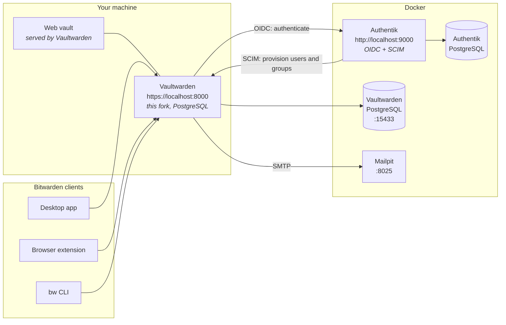
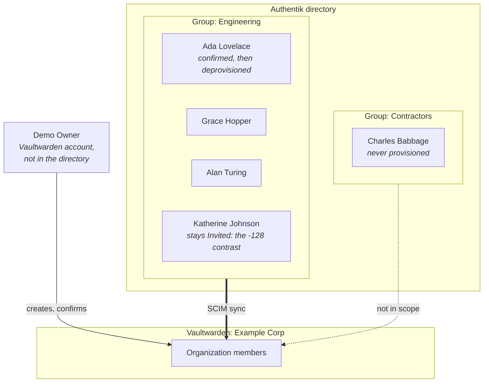
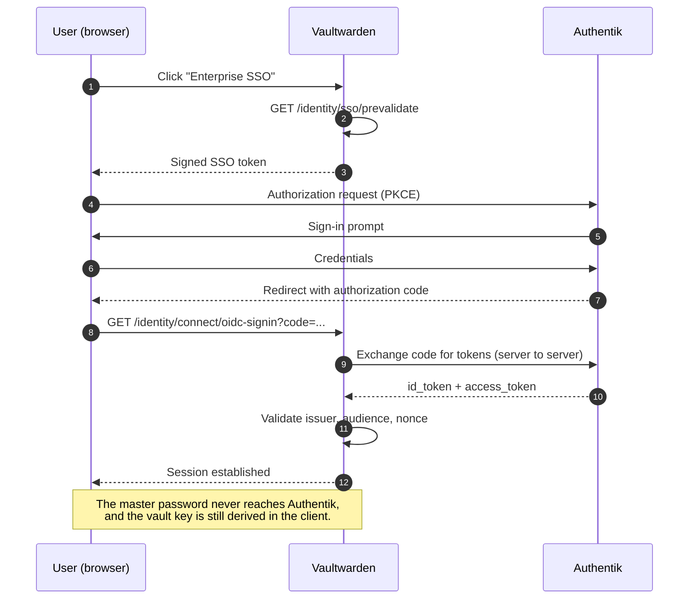
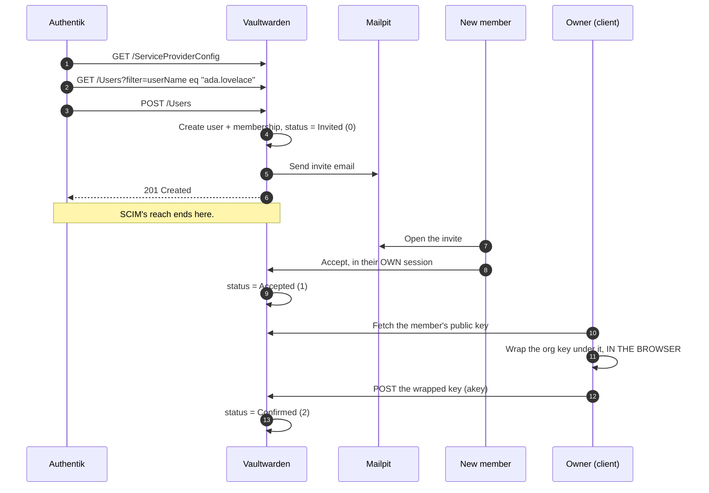
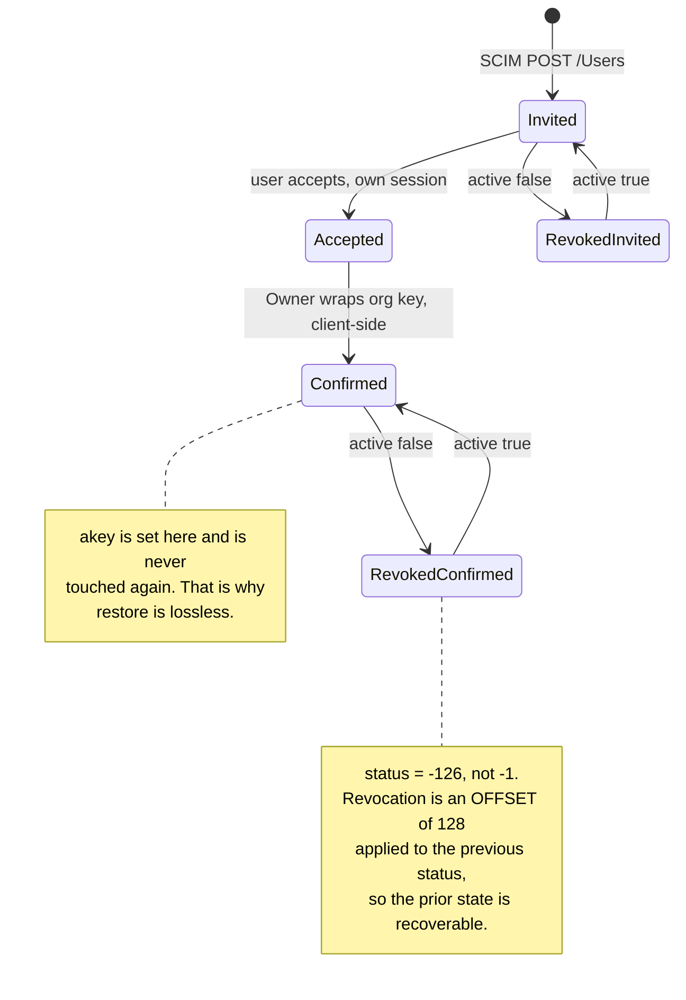
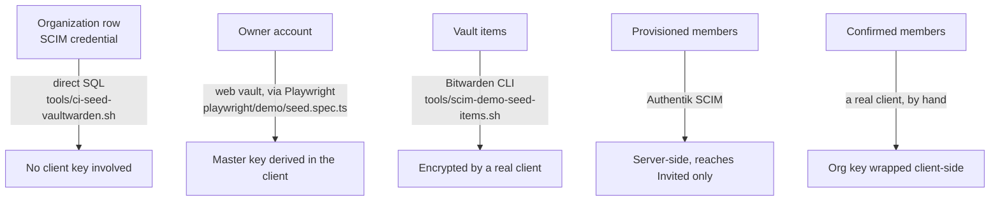

# The demo: how the pieces fit, and what each one proves

A walkthrough of the local demo environment - what runs, how the directory is
shaped, and how SSO and SCIM interact. The build plan and its phase status live
in [demo-plan.md](demo-plan.md); this document explains the thing being built.

The demo exists because the automated rungs in [testing.md](testing.md) can show
that the endpoint behaves correctly but cannot show that the feature *works* -
the step that matters most, a member being confirmed, requires a real client
holding real key material.

---

## What runs



**The two arrows between Authentik and Vaultwarden point in opposite
directions, and that is the whole point.** Authentik pushes *identity* into
Vaultwarden over SCIM; Vaultwarden pulls *authentication* from Authentik over
OIDC. One directory, two protocols, which is exactly how Entra behaves in a real
deployment.

Everything is local. Mailpit accepts all mail, so provisioned users can be
fictional addresses with no real mailbox.

---

## The directory

Defined declaratively in
[`tools/authentik/blueprints/demo-directory.yaml`](../../tools/authentik/blueprints/demo-directory.yaml)
and applied by Authentik's worker on startup.



Three deliberate choices:

- **Two groups, only one synced.** Contractors exists so the demo can show a
  negative: SCIM provisions what it is scoped to and leaves the rest of the
  directory alone. A single-group demo cannot demonstrate that.
- **The Owner is not in the directory.** They are an ordinary Vaultwarden
  account with a master password. Someone has to hold the organization key
  before anyone can be confirmed, and that person cannot themselves be
  SCIM-provisioned - a chicken-and-egg the design has to start somewhere.
- **The directory users have no passwords.** They exist to be provisioned and
  deprovisioned. Giving them passwords would mean committing per-user secrets.

---

## SSO: how a sign-in works



The callback URI is **not** a free choice: Vaultwarden generates
`sso_callback_path` from `DOMAIN` as `{domain}/identity/connect/oidc-signin`
([src/config.rs:1388](../../src/config.rs#L1388)), so the redirect URI registered
in Authentik must match it exactly. Change `DOMAIN` and you must change the
blueprint.

**SSO authenticates; it does not decrypt.** Signing in through Authentik proves
who you are. It does not give the server your vault key, and it does not let the
server confirm an organization member - which is the point the next section
turns on.

---

## SCIM: provisioning, and where it stops



Steps 1-6 are automatic and happen on Authentik's own schedule. Steps 7 onward
cannot be automated by the server at all: confirming a member means wrapping the
organization's symmetric key under that member's RSA public key, and **no
server-side code path can produce a valid `akey`**. The server only ever stores
an opaque blob computed by a client.

This is why the demo installs real Bitwarden clients rather than mocking them.

### SSO does not accept the invite

Worth knowing before you assume signing in is enough. When an SSO user reaches
the "Join organization" screen and sets a master password, the client sends
`org_identifier = FAKE_SSO_IDENTIFIER` (`src/sso.rs:20`) - a placeholder meaning
"no specific organization". `post_set_password` therefore skips
`accept_org_invite` (`src/api/core/accounts.rs:481`), and the fallback that would
accept every pending invitation runs **only when mail is disabled**:

```rust
if CONFIG.mail_enabled() {
    mail::send_welcome(...)
} else {
    Membership::accept_user_invitations(...)
}
```

With SMTP configured - as any realistic deployment and this demo both are - the
emailed invite link is the proof of address ownership and remains required. So
SSO and the invite are **sequential, not alternatives**: SSO creates the account
and its client-side keys, the emailed link joins the organization.

This is upstream behaviour and not something SCIM changes. It is worth stating
because the SSO screen says "Finish joining this organization", which reasonably
reads as though it does.

---

## Member state, including deprovisioning



The revoke/restore round trip is the most commercially interesting part of the
demo and the easiest to get wrong when reading the schema:

| Status | Stored value |
|---|---|
| Invited | `0` |
| Accepted | `1` |
| Confirmed | `2` |
| Revoked-invited | `-128` |
| Revoked-confirmed | `-126` |

`MembershipStatus::Revoked = -1` is a **comparison sentinel that is never
stored**. Any check written as `status == -1` is wrong for every real row; test
`status <= -1`.

Verify it during the demo rather than asserting it:

```sql
SELECT u.email, uo.status, LEFT(uo.akey, 24) AS akey, uo.external_id
FROM users_organizations uo JOIN users u ON u.uuid = uo.user_uuid
ORDER BY u.email;
```

Deactivating Katherine in Authentik moves her row to a negative status while
leaving `akey` byte-for-byte unchanged. Reactivating returns her to exactly the
prior state, with no re-confirmation - a returning employee is restored, not
re-onboarded.

---

## How the demo data gets created

Nothing that needs client-side cryptography can be seeded with SQL, which
divides the tooling in a way worth understanding before changing it:



**Vault items go through the `bw` CLI, not the browser.** Both are real clients
doing identical crypto, but the measured difference on the same six items was
minutes-and-repeatedly-stalling versus **18 seconds first try**. The CLI's
interface is documented and stable; the web vault's DOM changes between
releases. Playwright is kept only for registration, which the CLI genuinely
cannot do.

---

## Running it

```bash
tools/scim-sandbox.sh                                  # Vaultwarden + PostgreSQL + Mailpit + TLS
docker compose -p scim-demo -f tools/authentik/docker-compose.demo.yml up -d
cd playwright && npx playwright test --config demo.config.ts   # register the Owner
tools/scim-demo-seed-items.sh                          # fill the vault
```

Then follow the twelve-step flow in [demo-plan.md](demo-plan.md#phase-5---the-guided-demo-flow).

Prerequisites, cross-platform `mkcert` instructions and how to point each client
at the sandbox are in [testing.md](testing.md#the-manual-sandbox---real-clients-real-mail-real-tls).
For pointing clients at a server without the user configuring anything - browser
policy, MDM, and why the desktop app is the awkward one - see
[client-rollout.md](client-rollout.md).
