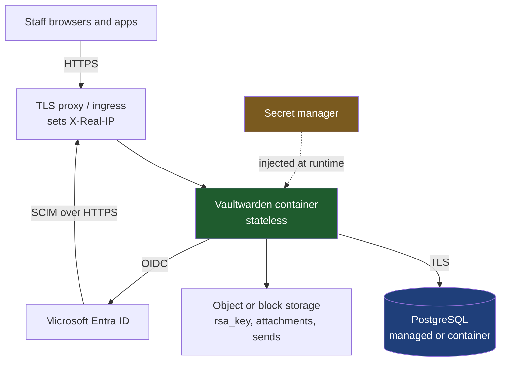

# Deployment: containers, PostgreSQL, SSO, SCIM, and break-glass

A cloud-agnostic reference deployment. Everything here runs unchanged on plain
Docker, Docker Swarm, Nomad, Kubernetes, AWS ECS, Azure Container Apps, and
Google Cloud Run - because it depends only on a container runtime, a PostgreSQL
endpoint, object or block storage, and a TLS-terminating proxy. No managed
service is required by name.

Read [setup.md](setup.md) for the SCIM and Entra detail; this guide is the
infrastructure around it and the order to do things in.

---

## Topology



The container is stateless. All durable state is in PostgreSQL and the storage
volume, which is what makes it portable across platforms and safe to replace.

---

## Step 1: PostgreSQL

Any PostgreSQL 13+ endpoint. Managed (RDS, Azure Database, Cloud SQL, Neon) or a
container you run - Vaultwarden does not care.

Requirements:

- **TLS in transit.** Append `?sslmode=require` to the connection URL.
- **A dedicated database and role**, not a shared one, and not a superuser.
- **Automated backups with a tested restore.** See
  [upgrading.md](upgrading.md#pre-flight) - an untested backup is not a backup.

```
DATABASE_URL=postgresql://vaultwarden:<password>@db.internal:5432/vaultwarden?sslmode=require
```

Vaultwarden runs its own migrations at startup, so the role needs DDL rights on
its own schema. It does not need rights anywhere else.

## Step 2: Storage

Two options, both portable:

- **Block volume** - any RWO volume mounted at `/data`. Simplest, and correct
  for a single instance.
- **Object storage** - this fork routes storage through OpenDAL, so
  `ATTACHMENTS_FOLDER`, `SENDS_FOLDER` and the RSA key path accept `s3://` URLs.
  Requires building the image with `--features postgresql,s3`; the stock image
  does not include it.

Whichever you choose, the **`rsa_key.pem` must be stable and backed up**. It is
the JWT signing key: lose it and every session is invalidated; let two instances
generate different ones and users get random logouts.

## Step 3: Secrets inventory

Decide where each of these lives *before* the first boot. They are not the same
kind of credential and they do not get the same treatment.

| Secret | Class | Rotatable | Where it belongs |
|---|---|---|---|
| `DATABASE_URL` password | machine | Yes | Secret manager, injected as env at runtime |
| `ADMIN_TOKEN` | machine | Yes | Argon2 PHC in config; plaintext only in the secret manager |
| `SSO_CLIENT_SECRET` | machine | Yes | Secret manager |
| SCIM bearer token | machine | Yes | Secret manager + pasted into Entra |
| **Break-glass Owner master password** | **human, E2EE** | **No - unrecoverable** | **See [the conundrum](#the-conundrum-where-does-the-password-managers-own-password-live)** |

Inject machine secrets as environment variables from your platform's secret
store (AWS Secrets Manager, Azure Key Vault, GCP Secret Manager, Kubernetes
Secrets backed by an external operator, Nomad Vault integration). **Never bake
them into the image or commit them.**

Generate the admin token as an Argon2id hash rather than plaintext - the binary
has a subcommand for it:

```bash
docker run --rm vaultwarden/server:latest /vaultwarden hash --preset owasp
# paste the resulting $argon2id$... string as ADMIN_TOKEN
```

Config validation rejects a plaintext `ADMIN_TOKEN` with a warning pointing at
this. Better still, set `DISABLE_ADMIN_TOKEN=true` in normal operation and enable
the panel only for a maintenance window.

## Step 3b: Rotating this deployment's own credentials

Rotation breaks production when it is treated as a **swap**. It has to be an
**overlap**: two credentials valid at once, cut over, verify, then retire the old
one. Each credential below either supports overlap natively or needs a window,
and it is worth knowing which before you need to rotate in a hurry.

| Credential | Overlap possible? | Procedure | Impact if done right |
|---|---|---|---|
| `DATABASE_URL` password | Yes, with two roles | Create a second role with the same grants, deploy with it, drop the first | None |
| `SSO_CLIENT_SECRET` | Yes - Entra allows two secrets on an app registration | Add secret B, deploy with B, delete A | None |
| SCIM bearer token | **No** - one key per organization | Mint, then paste into Entra | One sync cycle of 401s, self-healing |
| `ADMIN_TOKEN` | No, single value | Generate a new Argon2 PHC, redeploy | Existing admin sessions survive; new logins need the new token |
| **Break-glass master password** | N/A | Change it in the web vault, then **re-seal every copy** | None technically; the risk is a stale envelope |

Two rules make the difference:

**Verify before you retire, using usage telemetry.** The failure that hurts is
not during rotation, it is weeks later when something nobody knew about tries the
old credential. Before deleting the old one, confirm nothing is still using it.
The SCIM key exposes exactly this as `lastUsedAt` on
`GET .../scim/status` - see [operations.md](operations.md).

**Disable before delete, because disable is reversible.** For the SCIM token,
`PUT .../scim/api-key/enabled` with `false` stops it now and can be undone in
seconds; deleting it destroys the digest. Rotate by disabling the old state
first, watching, and only then committing.

The SCIM token is the one here that cannot overlap, so its rotation is worth
stating explicitly:

1. Mint the new token as an **Owner**. The old one dies the instant the new row
   is written - there is deliberately no grace period, because a rotation that
   left the previous credential working would not be a revocation.
2. Paste it into the Entra enterprise application and run **Test Connection**.
3. Entra retries on its own cycle, so requests between step 1 and step 2 fail and
   are then picked up automatically. Provisioning lags; it does not break.
4. Confirm `lastUsedAt` advances on the next cycle.

Do this once in the dev environment before you need it in production. A rotation
procedure nobody has executed is the same class of thing as an untested backup.

## Step 4: The container

A reference `compose.yaml`. On ECS/Cloud Run/ACA/Kubernetes the same environment
variables and the same volume map onto that platform's task or pod definition -
nothing here is Compose-specific except the syntax.

```yaml
services:
  vaultwarden:
    image: vaultwarden/server:latest      # pin a digest in production
    restart: unless-stopped
    environment:
      DOMAIN: "https://vault.example.com"
      DATABASE_URL: "${DATABASE_URL}"     # from your secret manager
      ADMIN_TOKEN: "${ADMIN_TOKEN}"       # Argon2 PHC string
      DISABLE_ADMIN_TOKEN: "true"         # flip to false only for maintenance

      SIGNUPS_ALLOWED: "false"            # provisioning is via SCIM, not self-signup
      INVITATIONS_ALLOWED: "true"         # SCIM needs this to create accounts
      SIGNUPS_DOMAINS_WHITELIST: "example.com"

      ORG_EVENTS_ENABLED: "true"          # without this the audit log is a no-op
      ORG_GROUPS_ENABLED: "true"
      SCIM_ENABLED: "true"

      IP_HEADER: "X-Real-IP"              # must match what your proxy sets
      # The header is only honoured when the request arrives FROM a trusted
      # proxy. "local" (the default) covers a proxy on the same host or
      # container network. If yours connects from a public address, list it
      # here as an IP or CIDR, or the header is silently ignored.
      IP_HEADER_TRUSTED_PROXIES: "local"

      SMTP_HOST: "smtp.example.com"       # required: SCIM invites are emailed
      SMTP_FROM: "vault@example.com"
      SMTP_PORT: "587"
      SMTP_SECURITY: "starttls"
    volumes:
      - vw-data:/data
    healthcheck:
      test: ["CMD", "curl", "-fsS", "http://localhost:80/alive"]
      interval: 30s
      timeout: 5s
      retries: 3

volumes:
  vw-data:
```

`/alive` proves the process is up *and* holds a working database connection, so
use it for readiness as well as liveness.

> **Pin the image by digest in production.** `:latest` makes your deployment
> non-reproducible and turns an upstream release into an unplanned upgrade -
> including its migrations. See [upgrading.md](upgrading.md).

## Step 5: TLS proxy

Terminate TLS in front of the container and **set the client IP header**:

```nginx
location / {
    proxy_pass         http://vaultwarden:80;
    proxy_set_header   Host              $host;
    proxy_set_header   X-Real-IP         $remote_addr;   # must match IP_HEADER
    proxy_set_header   X-Forwarded-Proto $scheme;
    proxy_http_version 1.1;
    proxy_set_header   Upgrade           $http_upgrade;  # WebSocket for live sync
    proxy_set_header   Connection        "upgrade";
}
```

Getting `X-Real-IP` wrong is the single most common cause of a failed first
sync: without it every Entra request looks like one client and the SCIM rate
limiter returns 429 partway through the initial load.

**Setting the header is necessary but not sufficient.** Vaultwarden only reads
`IP_HEADER` when the request arrives from an address listed in
`IP_HEADER_TRUSTED_PROXIES`, otherwise it falls back to the peer address - which
is the proxy, producing exactly the symptom above no matter how correctly the
proxy is configured. The default `local` accepts the header from any
non-global address, so a proxy on the same host or Docker network needs nothing
further. A proxy that connects from a public address - a separate host, or some
cloud load balancers - must be listed explicitly:

```
IP_HEADER_TRUSTED_PROXIES=203.0.113.10,198.51.100.0/24
```

This fails quietly. The "header ignored, not a trusted proxy" message is logged
at `debug` level, so at default log levels a misconfigured deployment looks
identical to one with no proxy header at all. If you see 429s during initial
sync and `X-Real-IP` is definitely being set, check this setting before
anything else.

---

## Step 6: First boot and the break-glass Owner

**Do this before enabling SSO or SCIM.** The order matters - you want a working
non-federated way in before you add dependencies on the IdP.

1. Start the container with `SIGNUPS_ALLOWED=true` temporarily.
2. Register **one account that does not and will never exist in Entra**. Use a
   role address on a domain you control, not a person: `vault-breakglass@example.com`.
3. Create the organization with that account. It becomes the first Owner.
4. Set `SIGNUPS_ALLOWED=false` and restart.
5. Enrol a second, day-to-day Owner (a real administrator) so routine work never
   touches the break-glass account.
6. Enable 2FA on the break-glass account. Store the TOTP seed or hardware key
   **with** the password, not separately - a break-glass you cannot complete is
   not a break-glass.

Why the break-glass Owner must not be in Entra: if it were, a compromise or
outage of the IdP takes it with everything else. That is the failure the account
exists to survive. `GET /api/organizations/<org>/scim/status` reports
`directoryLinkedOwners` and raises `breakGlassWarning` when **every** confirmed
Owner carries a SCIM `externalId` - check it after the first sync.

## Step 7: SSO

```bash
SSO_ENABLED=true
SSO_AUTHORITY=https://login.microsoftonline.com/<tenant-id>/v2.0
SSO_CLIENT_ID=<application-id>
SSO_CLIENT_SECRET=<from your secret manager>
SSO_SCOPES="email profile"
SSO_PKCE=true                    # default, keep it
SSO_SIGNUPS_MATCH_EMAIL=false    # stricter; see below
```

Register a **separate** Entra app registration for SSO from the one used for
SCIM provisioning. Redirect URI is `https://vault.example.com/identity/connect/oidc-signin`.

Two settings deserve a decision rather than a default:

- **`SSO_SIGNUPS_MATCH_EMAIL`** - with `false`, SSO refuses to adopt an existing
  account that already has a keypair. A SCIM-provisioned shell account has no
  keypair, so it still links. That asymmetry is what stops an SSO identity
  claiming an established account by email alone.
- **`SSO_ONLY`** - see the warning below. This one interacts directly with your
  break-glass design.

### `SSO_ONLY=true` disables password login for *everyone*

Verified in this codebase: `src/api/identity.rs:75` rejects every `password`
grant when `SSO_ENABLED && SSO_ONLY`. There is **no per-account exemption**, so
your break-glass Owner cannot log in with its master password either.

That does not make `SSO_ONLY` wrong - it is a genuinely stronger day-to-day
posture - but it changes the break-glass procedure:

| | `SSO_ONLY=false` (default) | `SSO_ONLY=true` |
|---|---|---|
| Day-to-day posture | Password login available to all | SSO enforced, phishing-resistant if your IdP is |
| Break-glass path | Log in with the sealed master password | Operator must set `SSO_ONLY=false` and restart **first** |
| Break-glass depends on | The sealed envelope | The sealed envelope **and** infrastructure/deploy access |

**Recommendation: `SSO_ONLY=true`, with the toggle written down as a tested
procedure.** The stronger daily posture is worth it, and flipping an environment
variable is a legitimate controlled break-glass. But you must then confirm your
infrastructure access is **not** federated to the same Entra tenant, or you have
rebuilt the circular dependency one layer down.

**A third path exists and is worth knowing:** the `/admin` panel authenticates
with `ADMIN_TOKEN` and is *not* subject to `SSO_ONLY`. It cannot read any vault
(end-to-end encryption still applies) but it can manage users and organizations,
and it is where you clear a stale SSO association. Treat `ADMIN_TOKEN` as a
break-glass credential in its own right.

## Step 8: SCIM

Follow [setup.md](setup.md). Two deployment-level notes:

- Mint the token as an **Owner**, not merely an admin.
- Store the returned token in your secret manager as well as pasting it into
  Entra. It is shown exactly once.

## Step 9: Organization policies

Set these in the web vault once the org exists:

- **Two-step login required** - the meaningful one.
- **Single organization** - stops members joining external orgs with the same
  account.
- **Master password policy** - minimum length and complexity.
- **Account recovery administration** - lets an administrator reset a member's
  password. Worth enabling: it reduces how often anyone needs the break-glass
  account. It does **not** replace it, because it requires at least one other
  confirmed administrator still holding the organization key.

---

## The conundrum: where does the password manager's own password live?

You cannot store the password manager's recovery credential in the password
manager. That is a genuine circular dependency, and it is the same problem as
AWS root account credentials, HashiCorp Vault unseal keys, a PKI root CA key,
and a crypto seed phrase. It has a settled industry answer.

### First, separate the credentials

Most of the secrets in this deployment are **not** hard. Database password,
`ADMIN_TOKEN`, SSO client secret, SCIM token: all machine credentials, all
rotatable, all belong in your cloud secret manager with audit logging. If one
leaks you rotate it and move on.

Exactly one credential is different: the **break-glass Owner's master
password**. Under end-to-end encryption it derives the key that unwraps the
vault. No administrator, no server operator, and no cloud provider can reset or
recover it. It is not "difficult to recover" - it is mathematically
unrecoverable. Treat it as a different class of thing entirely.

### The standard answers, in order

**1. Offline, tamper-evident, dual custody.** Print it. Seal it in a
tamper-evident envelope. Store it in a safe or a bank safe-deposit box. Require
two named people to retrieve it, and log every access.

This looks low-tech and it is the correct primary answer, for the same reason
AWS recommends it for root credentials: it removes every electronic dependency,
so no outage, compromise, or federation failure can stand between you and it.

**2. Split knowledge, M-of-N.** Split the secret into N shares where M are
needed to reconstruct (Shamir's Secret Sharing - `ssss`, or your KMS's
equivalent). No individual can use it unilaterally. This is what Vault does for
unseal keys and what root CA key ceremonies do.

Use it when insider risk is a real concern. It only works if the reconstruction
procedure is **written down and rehearsed** - an M-of-N scheme nobody remembers
how to reassemble is an elaborate way of losing the secret.

**3. An independent secrets system with non-federated break-glass access.**
Cloud KMS or secret manager. Convenient and auditable, with one critical
caveat: **check for the circular dependency.** If your cloud console login is
federated to the same Entra tenant that SCIM manages, and Entra is what has
failed, you cannot reach the secret. This requires a cloud break-glass identity
that does not use SSO - which is the same problem again, one layer down, and
usually ends back at answer 1.

### "What if the safe burns down?"

The right objection to answer 1, and it has a real answer: **one copy in one
location is not the recommendation - it is the starting point.**

**Geographic redundancy.** Apply the 3-2-1 backup rule to physical secrets: at
least **two copies in locations that cannot burn down together**, ideally three.
A different building is the minimum; a different suburb is better; a different
seismic and flood zone is better again. Typical split: the office safe, a bank
safe-deposit box in another city, and optionally a third with the company
secretary or the organisation's legal firm.

**Each copy individually sealed and serialised.** Number the envelopes. A
register - which is not itself secret - records how many copies exist, where
each one is, who may retrieve it, and when each was last verified. Serial
numbers mean that if one is opened you know *which*, so you can rotate rather
than guess.

**The medium matters more than people expect.** "Fireproof" is a rating, not a
property: a UL Class 350 one-hour safe keeps its interior below 177 °C for an
hour, while paper chars around 230 °C - so a document safe is fine for paper and
a *media* safe is needed for anything magnetic. For a short secret like a master
password, stamped steel or titanium plates - the medium the cryptocurrency world
settled on for seed phrases - survive fire, flood, and collapse in a way paper
does not, and cost very little.

**Redundancy fights confidentiality, and M-of-N is how you stop it.** Every extra
copy is another place to steal from. Shamir's Secret Sharing decouples the two:
distribute 5 shares across 5 locations needing any 3 to reconstruct, and you can
lose two locations to a disaster *and* have two stolen, and still be fine either
way. That is the actual answer to "what if the safe burns" once you have more
than one thing to protect.

**The strongest redundancy is not a copy at all - it is a second Owner.** The
sealed envelope only matters when *every* other route in is gone. With three
confirmed Owners, one of them break-glass, losing the envelope is not an
incident: a surviving Owner creates a new break-glass account and you re-seal.
Layer it:

| Layer | Survives | Cost |
|---|---|---|
| Multiple confirmed Owners | Any one person leaving, being ill, or being compromised | Free |
| Geographically redundant sealed copies | Loss of all Owners; a site disaster | Low |
| M-of-N shares | The above, plus insider risk from any single custodian | Medium, needs rehearsal |

**And remember the vault itself.** The same fire that reaches the safe may reach
the datacentre. Offsite PostgreSQL backups and a copy of `rsa_key.pem` are part
of this plan, not a separate one - a perfectly preserved break-glass password
that unlocks a database nobody has is worth nothing.

**The realistic failure is not fire.** It is: the person who sealed the envelope
left, nobody updated the register, and the safe is opened during an incident to
find a password that was rotated eighteen months ago. That is a process failure,
and the quarterly test below is what catches it.

### What not to do

- In the Vaultwarden instance it protects (circular)
- In a wiki, ticket, shared drive, or chat message
- In an individual's personal password manager (bus factor, and it walks out
  with them at offboarding)
- Only in someone's memory
- In a CI variable or a repo, encrypted or otherwise

### Recommended composite

For an enterprise deployment of this size:

1. **Two or more confirmed Owners**, so losing one person is not an incident.
2. **At least one Owner that does not exist in Entra at all.** Verify with
   `breakGlassWarning` in `/scim/status` after every material change.
3. **Break-glass master password and its second factor**: sealed, serialised,
   dual-custody, in **at least two locations that cannot burn down together**.
   The password and its second factor travel together in each envelope - a
   break-glass you cannot complete is not a break-glass.
4. **`ADMIN_TOKEN` treated as a second break-glass credential**, stored the same
   way, since it survives an SSO outage.
5. **Machine credentials in the cloud secret manager**, rotated on a schedule.
6. **Test it quarterly.** Open the envelope, log in, confirm it works, reseal,
   log the test. An untested break-glass fails exactly when you need it - the
   same principle as the untested backup in [upgrading.md](upgrading.md).

Point 6 is the one organisations skip, and it is the one that decides whether
any of the rest mattered.

---

## Verification checklist

- [ ] `/alive` returns 200 through the proxy
- [ ] `X-Real-IP` reaches the container (check a log line under `request`)
- [ ] `X-Real-IP` is actually *honoured*, not just delivered: two requests from
      different client IPs must get separate rate-limit buckets. If they share
      one, the proxy is not covered by `IP_HEADER_TRUSTED_PROXIES`
- [ ] WebSocket upgrade works (live sync in the web vault)
- [ ] PostgreSQL uses TLS, backups run, **restore tested**
- [ ] `rsa_key.pem` is on durable, backed-up storage
- [ ] `ADMIN_TOKEN` is an Argon2 PHC string, or the panel is disabled
- [ ] `SIGNUPS_ALLOWED=false` after the break-glass account exists
- [ ] Break-glass Owner exists, is **not** in Entra, has 2FA, and is sealed away
- [ ] Break-glass sealed in **two or more geographically separate locations**,
      envelopes serialised, register maintained
- [ ] Break-glass login has been tested end to end at least once
- [ ] Offsite PostgreSQL backup and a copy of `rsa_key.pem` exist (a recoverable
      password against an unrecoverable database is worth nothing)
- [ ] If `SSO_ONLY=true`: the toggle procedure is written down and infrastructure
      access is not federated to the same tenant
- [ ] SSO login works for a normal user
- [ ] SCIM token minted as Owner, stored in the secret manager, Test Connection passes
- [ ] `breakGlassWarning` is absent from `/scim/status` after the first sync
- [ ] Org policies set: 2FA required, single org, master password policy
