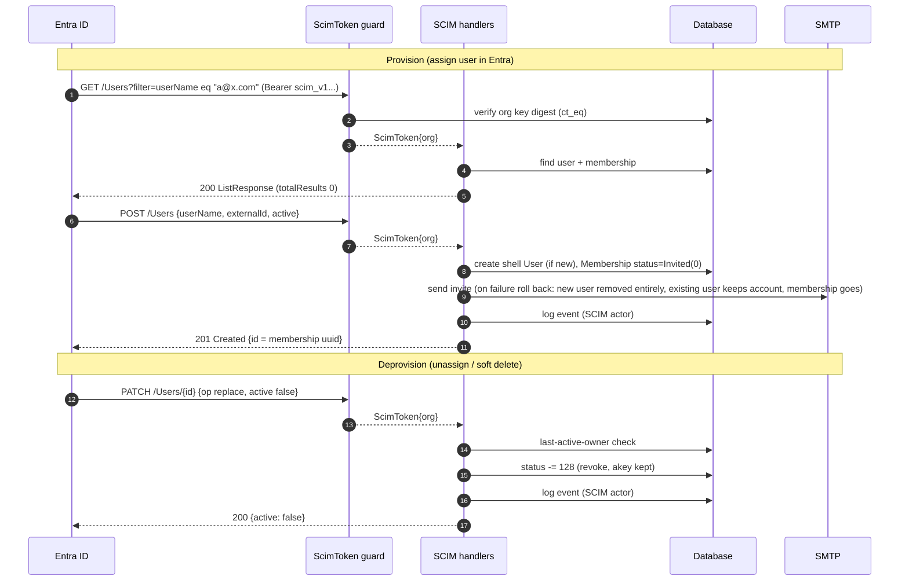
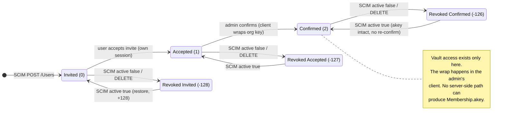
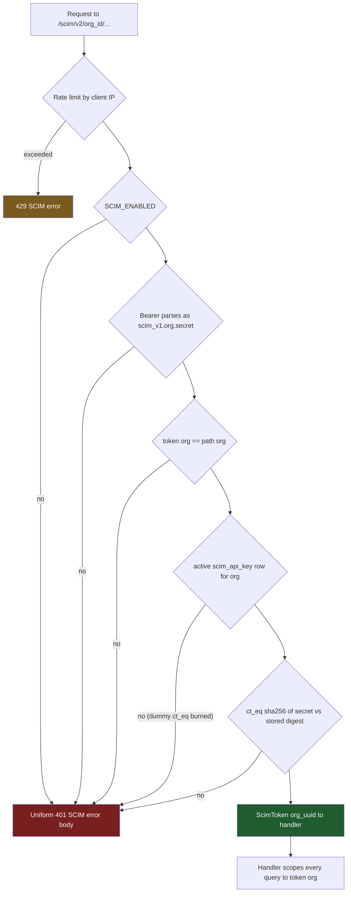
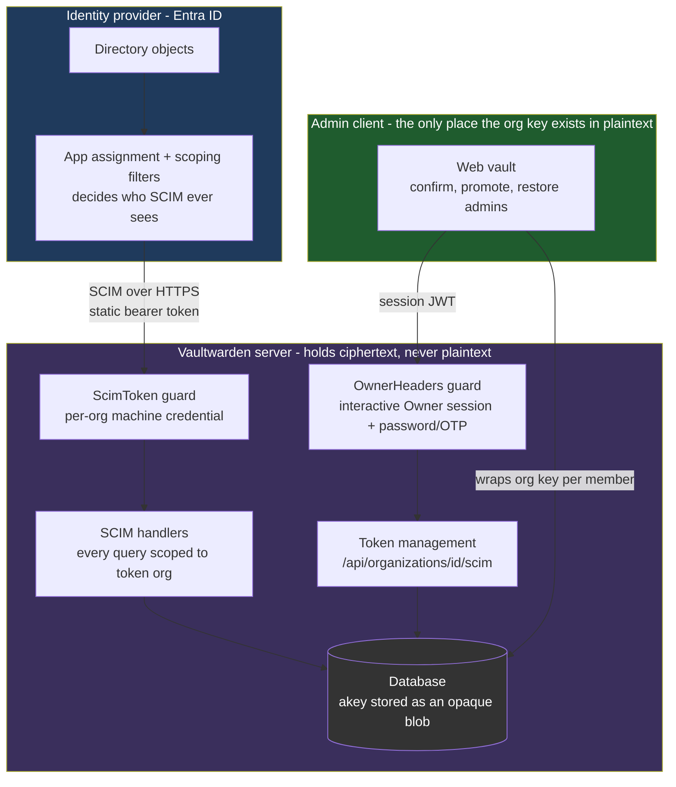
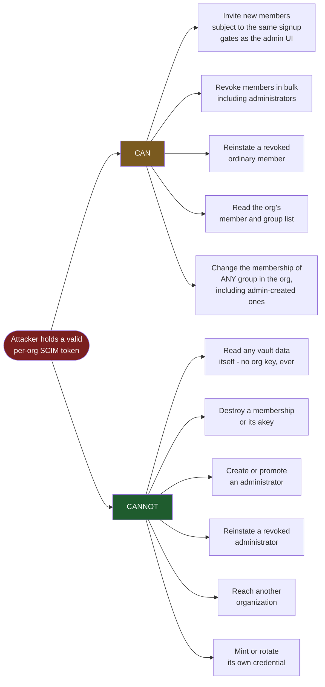
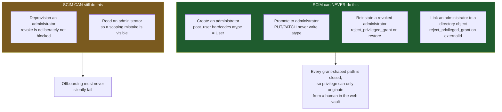
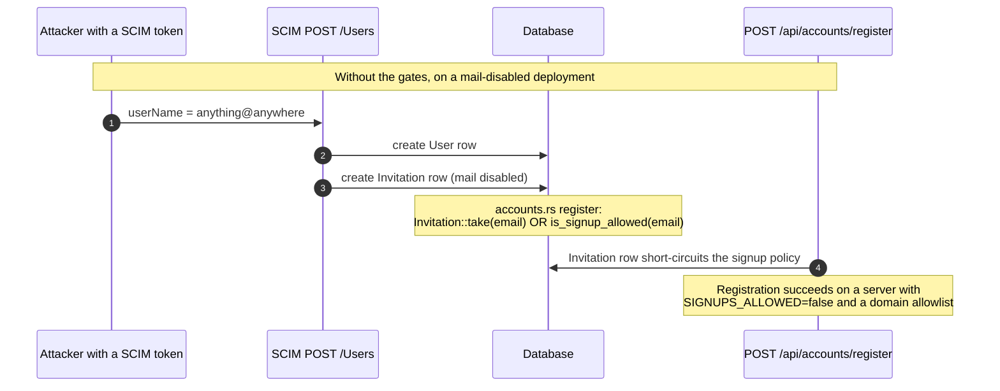
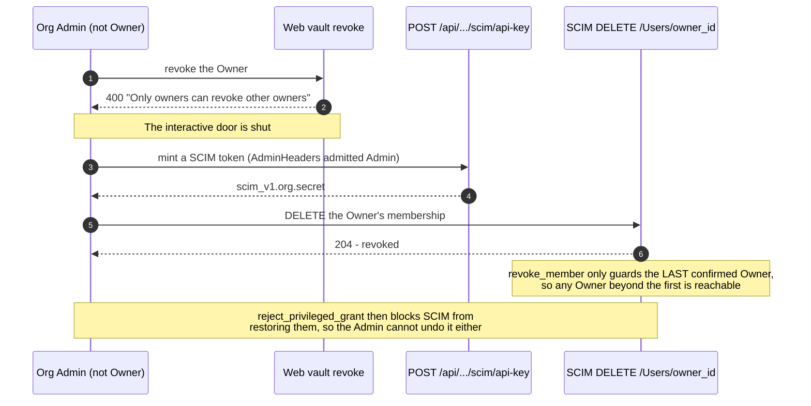
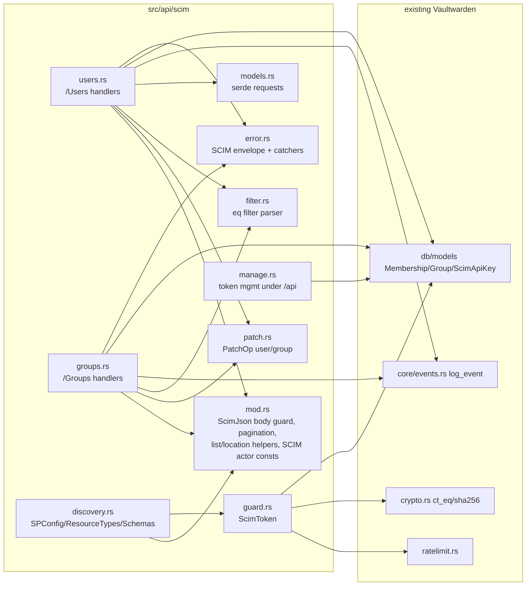
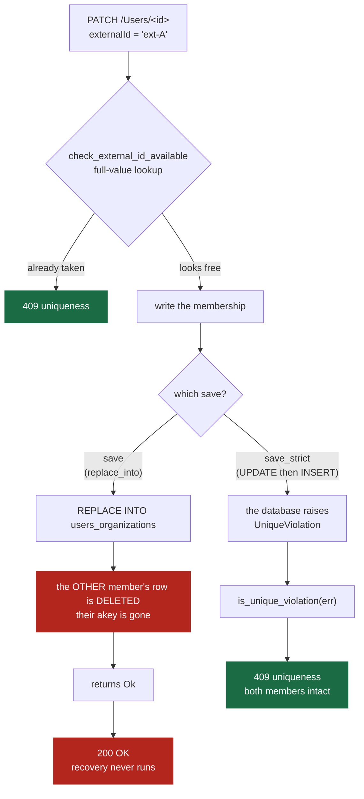

# SCIM v2 design

Architecture and security model for the SCIM implementation in this fork.
Operator instructions live in [README.md](README.md).

## Provision and deprovision flows



## Membership state machine

The revocation encoding is the one non-obvious invariant in the whole
integration: revoked is a stored **offset** (`status - 128`), and the enum
value `Revoked = -1` never reaches the database. Every active/inactive
decision in the SCIM code funnels through one helper that tests
`status <= -1`.



Why confirm cannot be automated server-side, verified against source:

- `Organization.private_key` is stored encrypted under the org symmetric key;
  the server cannot decrypt it.
- `confirm_invite_impl` only stores an opaque client-computed blob into
  `Membership.akey`.
- Account Recovery cannot substitute: enrollment is self-service and needs
  the user's master password, and `recover_account` requires the member to
  already be Confirmed. It is gated behind the state it would need to reach.

A future companion *confirm-worker* (a headless client holding an admin
account, wrapping keys client-side and posting `bulk_confirm_invite`) could
automate step three without weakening zero-knowledge. It is deliberately not
part of the server.

## Authentication

The credential is a per-organization static bearer token,
`scim_v1.<org_uuid>.<secret>`, because Entra's provisioning client sends a
fixed Secret Token and cannot run an OAuth flow (which rules out reusing the
one-hour organization api-key JWT that `/api/public` uses).

- The secret is 32 random bytes (256 bits). At rest it exists only as a
  sha256 hex digest in the `scim_api_key` table.
- sha256 instead of argon2 is deliberate: argon2's cost is protection for
  low-entropy human passwords. This secret is machine-generated at full
  entropy, so digest inversion is infeasible, while per-request argon2 on an
  unauthenticated endpoint would be a denial-of-service amplifier during
  Entra's sync bursts.
- Verification uses a constant-time compare, with a dummy compare when no
  key row exists. The dominant timing signal is still the database lookup;
  the dummy compare is hygiene, not a timing-proof guarantee.
- An active `scim_api_key` row is also the per-org enable switch; the global
  `SCIM_ENABLED` config is the master gate. Both must hold.
- Generation and rotation require an interactive **Owner** session plus
  master-password or OTP re-authentication. Rotation replaces the row, so
  the previous token dies instantly. The plaintext is returned exactly once
  and never logged.



Every 401 leaving the mount is byte-identical regardless of which check
failed (asserted by test); causes are logged server-side only. Misses on
filters return empty lists and unknown ids return the same 404 as another
org's ids, so the surface does not confirm what exists.

## Security model

This section exists so that a future maintainer can tell which behaviours are
load-bearing security properties and which are incidental. If you are about to
change something described here, the rationale is the thing to argue with - not
the code.

### Trust boundaries



Three boundaries matter:

1. **IdP to server.** The credential is a static, per-organization bearer token.
   It is a machine credential with no human behind it, so everything it can
   reach must be safe to automate. Its blast radius is deliberately bounded -
   see the threat model below.
2. **Server to database.** The server is trusted with ciphertext only.
   `Membership.akey` is the organization key wrapped under a member's RSA public
   key; the server stores it and can never read or produce it. This is what
   makes "auto-confirm" impossible, not a missing feature.
3. **Admin client to everything.** All organization-key cryptography happens in
   an admin's browser. Confirming a member, and any change to a privileged
   membership, terminates here by design.

### Threat model: a leaked SCIM token

The realistic compromise is the token leaking - from the IdP configuration, a
backup, or an administrator who kept a copy. The design is shaped around
bounding what that buys an attacker.



Three of the "CAN" entries deserve their reasoning stated, because all three
look like holes until you compare them against the alternative:

- **Bulk revoke is permitted and is recoverable.** The last *active* Owner
  cannot be revoked, so at least one Owner always survives, and restore is
  lossless - that Owner reinstates everyone else from the web vault with no
  re-invite and no re-confirmation. Blocking bulk revoke would mean blocking
  deprovisioning, which is the highest-value thing this feature does.
- **Reinstating an ordinary member is the intended deprovision/reprovision
  cycle.** It is also why the token should be scoped and rotated like an
  access-granting credential, not merely an invite one.
- **Group membership is unscoped, and this is the widest CAN entry.** SCIM
  resolves a group by its `GroupId`, so `PUT`/`PATCH /Groups/<id>` reaches
  *every* group in the organization - including one an administrator created in
  the web vault and granted access to a sensitive collection. Vaultwarden grants
  collection access through `groups_users -> collections_groups` with no
  per-collection key, so adding a member to such a group gives that member real
  plaintext access to collections nobody granted them.

  Read "CANNOT read any vault data" precisely: the token holder still gets
  nothing, because they hold no org key. What they get is the ability to hand
  access to *someone else* - which matters if they control, or have compromised,
  an already-confirmed member.

  This is a genuine widening relative to the credential this guard was modelled
  on: `ldap_import` resolves groups strictly by `external_id`, so a group with no
  `external_id` is unreachable by that token. It is also inherent to SCIM group
  sync in general - membership implies access in every implementation, Bitwarden's
  included - and narrowing it means either refusing writes to groups SCIM does not
  own, or refusing them to `access_all` groups. **Operationally, until that is
  decided: do not grant a SCIM-reachable group access to a collection you would
  not give the IdP itself.**

Note what a reinstatement does *not* give an attacker: `akey` is wrapped under
the member's own public key, so restoring a membership returns access to that
person, not to whoever holds the token. The threat is reinstating an offboarded
human who still knows their master password - which is precisely why
administrators are excluded from it.

### The privilege ceiling: SCIM never grants administrative access

This is the single most important invariant in the SCIM surface.



**Why the asymmetry.** It is tempting to block every write to a privileged
membership, on the reasoning that administrators are out of SCIM's scope
entirely. That reasoning is right about the *operating model* and wrong about
the *guard*, because the two failure modes are not symmetric:

| If the scoping practice slips | Revoke allowed (current) | Revoke blocked |
|---|---|---|
| An accidentally-scoped admin leaves the company | Correctly deprovisioned | Keeps vault access indefinitely, silently |
| A leaked token attacks the org | Admins revoked - recoverable by the surviving Owner | Admins protected |

A malicious mass-revoke is loud and self-correcting. An administrator who is
never deprovisioned is silent and open-ended. The guard is a backstop for a
practice that will occasionally slip, so it must degrade in the safe direction.

**The operating model, which is the primary control.** Administrators should be
excluded from the IdP's provisioning scope so this guard never fires at all -
by scoping filter rather than by assignment list, because a filter keeps holding
when an admin joins an assigned group. See "Keep organization administrators out
of scope" in [README.md](README.md). The hazard there is that a user who falls
*out* of scope is deprovisioned rather than ignored, so the filter belongs in
place before the first sync cycle.

### Keeping a break-glass Owner

Scoping protects the organization from a mistake in the provisioning app. It
does nothing about a compromise of the identity provider itself. An organization
whose every Owner is a directory identity has no recovery path from that.

The erosion is gradual and otherwise unrecorded: SCIM provisions somebody as a
plain member and sets their `externalId`, an administrator later promotes them
to Owner in the web vault, and that Owner is now a directory identity. Repeat
for everyone and the last independent Owner is gone.

`GET /api/organizations/<id>/scim/status` reports `confirmedOwners` and
`directoryLinkedOwners` so this is at least observable. Be precise about what
that proves:

- **`directoryLinkedOwners == confirmedOwners` is a definite negative.** Every
  Owner carries a SCIM correlation key, so every one of them came from the
  directory. The endpoint returns a `breakGlassWarning` in this case.
- **A lower count proves nothing on its own.** An administrator excluded by a
  scoping filter is never provisioned and so carries no `externalId` either. The
  server cannot distinguish that from a Vaultwarden-only account; whether a
  genuine break-glass Owner exists is a fact about the directory, not about this
  database.

### SCIM is not a weaker door than the admin UI

Creating an account through `POST /Users` applies the same two gates that
`invite_user` applies in `src/api/core/organizations.rs`: `INVITATIONS_ALLOWED`
and `SIGNUPS_DOMAINS_WHITELIST`. Skipping them was a real hole, not a
theoretical one, because of a non-obvious interaction:



An `Invitation` row is a hard override of `is_signup_allowed`. Any code path
that writes one must first apply the invitation and domain gates, or an
organization-scoped credential becomes a server-wide signup-policy bypass. This
applies to anything added later that provisions accounts, not just SCIM.

### Minting the credential is an Owner action

The same principle one level up: a credential must not be issuable by a role
that is not allowed to do what the credential does.

A SCIM token can revoke any member who is not the last active Owner. The web
vault refuses that outright for Owners - `organizations.rs` returns "Only owners
can revoke other owners". But `AdminHeaders` resolves through
`is_confirmed_and_admin`, which tests `membership_type >= Admin`, so it admits
Admins and Owners alike. Gating the mint on `AdminHeaders` therefore let an
Admin issue itself a machine credential that did what its own interactive
session was denied:



Fixed by requiring `OwnerHeaders` to mint or delete the token. Reading
`/scim/status` requires it too, and that was tightened rather than left alone:
the endpoint reports the credential's state, its `lastUsedAt`, and how many of
the organization's Owners are directory-linked - a map of the recovery path -
and an Admin is exactly the role that cannot mint, revoke or disable the
credential it describes. The role gate closes the same gap a password/OTP
step-up would, without forcing a GET to become a POST.

The general rule to keep: **the role that may create a credential must be at
least as privileged as the most privileged thing that credential can do.**
`revoke_member` was not tightened instead, because SCIM being able to
deprovision an administrator is the deliberate asymmetry documented above - the
fix belongs on who may mint, not on what the token may do.

### Failure-mode policy: what fails a request, and what only logs

Microsoft Entra disables ("quarantines") a provisioning application after
sustained failures, which stops provisioning for the whole tenant rather than
the one user. That makes "return an error" a decision with blast radius, so the
choice is made deliberately per failure:

| Failure | Response | Why |
|---|---|---|
| Invite mail fails | 201, log the error | The membership is valid and an admin can re-send from the web vault. Returning 5xx made Entra retry create-then-delete forever and risked quarantining the tenant |
| Membership row write fails | 500, roll back | Nothing references the user yet; leaving it would leak a shell account, and with it a registration bypass, on every retry |
| Concurrent create loses the race | 409 `uniqueness` | `users_organizations` carries `UNIQUE (user_uuid, org_uuid)`, so the winner's row is valid and must survive. No rollback |
| Restore blocked by org policy | 400, log with member and org | Never clears on its own, so the IdP retries indefinitely. The log line is the only operator-facing signal |
| Privileged membership grant | 400 `mutability` | Persistent per-user failure is the intended signal that scoping slipped. Do not suppress it |
| Groups disabled | 501 naming the config key | `ldap_import` skips silently; silence hides a misconfiguration in the IdP |
| Any uncaught status under /scim | SCIM `Error` envelope | A default catcher covers 503 (pool exhaustion) and 405, which would otherwise reach a JSON client as an HTML page |

Rollback is deliberately conservative. `User::delete` cascades **every**
membership, including other organizations', so it only runs when the account was
created by this request *and* still has no membership other than the one being
rolled back. A concurrent provision from another organization can attach one in
between, and destroying it would destroy an `akey` that cannot be recovered.

### Input bounds

Every limit exists because the endpoint is machine-driven and pre-authentication
work is attacker-reachable.

| Bound | Value | Rationale |
|---|---|---|
| Request body | 512 KiB (`SCIM_BODY_LIMIT`) | SCIM bodies are small; a tight cap limits abuse of a machine-auth endpoint |
| Group members per write | 1000 (`SCIM_MAX_GROUP_MEMBERS`) | Each value costs a lookup and a write; uncapped, one legal body drives tens of thousands of sequential queries while holding a pooled connection |
| Page size | 200 (`SCIM_MAX_RESULTS`) | Shared with the `filter.maxResults` advertised in ServiceProviderConfig, so the two cannot drift |
| Rate limit | per client IP, before any parsing or DB work | Unauthenticated floods are cut off first. Buckets are pruned on a schedule (`RATELIMIT_PRUNE_SCHEDULE`); the keyed store never evicts on its own |

The rate limiter keys on `ClientIp`. Upstream #7472 changed how that value is
derived, and it changed which half of this is still a risk. `IP_HEADER` is now
read only when the request arrives from an address covered by
`IP_HEADER_TRUSTED_PROXIES`; otherwise the header is ignored and the peer
address is used. So:

- **Bypass by rotating the header is closed by default.** An attacker
  connecting directly, or through a proxy the server does not trust, cannot
  choose their own bucket key. It reopens only if an operator sets
  `IP_HEADER_TRUSTED_PROXIES=all` while exposing the server to untrusted peers.
- **Starvation is still live, and is now easier to cause by accident.** If the
  proxy is not covered by the trusted list, every request falls back to the peer
  address - the proxy - and shares one bucket. Setting `IP_HEADER` correctly
  does not help, because the header is never read. The failure is silent at
  default log levels.

Both remain deployment requirements the server cannot enforce; see
[deployment.md](deployment.md) for the configuration and the check that
distinguishes "header delivered" from "header honoured".

## Module layout



The `/scim` mount carries its own catchers so every error, including ones
Rocket generates before a handler runs, is a SCIM `Error` envelope. Token
management deliberately lives under `/api` with `OwnerHeaders`: the SCIM
surface itself can never mint or rotate its own credential.

### Why SCIM writes never use `save`

Every SCIM membership and group write goes through `Membership::save_strict` /
`Group::save_strict`, never the `save` the rest of the codebase uses. This is the
single most important implementation constraint in the feature, and it is not
obvious from either function's name.

`save` uses `diesel::replace_into` on sqlite and mysql. SQL `REPLACE` resolves a
conflict on **any** unique index by DELETING the conflicting row and then
inserting. For the `uuid` primary key that is harmless - the row being replaced
is the row being saved. For `(org_uuid, external_id)`, added as UNIQUE in
`2026-07-26-000001`, it is not: the conflicting row belongs to a *different*
member, and deleting it destroys their `akey` - their wrapped copy of the
organization key. Under end-to-end encryption nobody can reconstruct that, the
server least of all.

So the UNIQUE index did not turn a duplicate correlation key into a failure. It
turned it into silent, unrecoverable data loss that reported success:



Two paths reach the conflict, and the second needs no concurrency at all:

1. **Two concurrent writes**, on any backend. Both pass the application-level
   check, and the loser's write lands on a value that is now taken.
2. **A mysql prefix collision, entirely sequential.** That index covers
   `external_id(150)` while `SCIM_MAX_EXTERNAL_ID_LEN` is 300 and
   `find_by_external_id_and_org` compares the whole value. Two externalIds
   sharing their first 150 characters are distinct to the application and
   identical to the index.

`is_unique_violation` inspects the error rather than re-reading the row for the
same reason: an exact-match re-read cannot see case 2, so it would report "no
conflict found" and fall through to a 500 - the one status a provisioning engine
retries until it quarantines the whole application.

PostgreSQL was never affected. Its `save` uses
`insert_into(..).on_conflict(uuid).do_update()`, whose conflict target is the
primary key alone, so a violation on any other index propagates as a real error.
That asymmetry is exactly why this was worth a diagram: the bug was invisible on
the backend most likely to be used for testing a large deployment, and present on
the default one.

**The general rule this leaves behind: never add a UNIQUE index to a table whose
write path is `replace_into`.** There, an index is not a constraint. It is a
delete trigger.

## Semantics that differ from a naive SCIM reading

| Topic | Choice | Reason |
|---|---|---|
| DELETE /Users | revoke, not delete | preserves `akey`; restore is lossless; compromised token cannot destroy state (but see the reinstatement note below, and the privilege ceiling in "Security model") |
| Roles | not synced (always User) | `Custom` collapses to Manager in `MembershipType::from_str`; no honest round-trip |
| userName/displayName updates | accepted, ignored | email is login identity; `user.name` is global to the person; erroring would fail every directory rename sync |
| Group DELETE | real delete | groups carry no E2EE state |
| Group members | ordered add/remove/replace, applied in the sequence sent | Entra PATCHes diffs, including `members[value eq "..."]` removal paths. Bucketing by op made `[remove X, add X]` and `[add X, remove X]` identical and let a `replace` discard a later `add` - both silent membership loss (RFC 7644 s3.5.2) |
| Group PUT without `members` | member set unchanged | RFC 7644 permits either reading; keeping membership means a sparse client cannot wipe a group by accident. Explicit `[]` still clears |
| externalId | unique per org, on every write path | it is the IdP correlation key; a duplicate would make filter lookups and later syncs target an arbitrary group. Users and Groups both 409 on conflict, self re-assertion allowed |
| Groups when disabled | loud 501 | `ldap_import` silently skips; silence hides misconfiguration in the IdP |
| Filter misses | empty 200 list | Entra Test Connection probes a random user; distinguishable misses enable enumeration |
| Deleted users stay retrievable | RFC 7644 s3.6 says a non-destructive provider MUST 404 the id afterwards and omit it from queries. Here a `GET` still returns 200 with `active: false` | Destroying the membership destroys the wrapped org key with no server-side path to recreate it. Entra tolerates this because its default deprovision is `active: false` - a named divergence for anyone integrating a different client |
| `meta` carries no `created`/`lastModified`/`version` | RFC 7643 s3.1 returns them by default | `Membership` has no revision timestamp to populate `lastModified` from, and inventing one would be a lie. Consequence: no delta sync, every cycle is a full enumeration |
| Discovery singletons | `/ResourceTypes/{id}` and `/Schemas/{id}` are served | Each collection entry advertises its own `meta.location`; without the handlers every advertised location 404s (RFC 7644 s4) |

### Revocation is IdP-authoritative, in both directions

Because restore is lossless, `active: true` is not just an onboarding signal - it
**reinstates a revoked member to exactly the state they were revoked from**,
including `Confirmed` with the wrapped org key intact and no re-confirmation. That
is the intended deprovision/reprovision behaviour, but it has a consequence worth
stating plainly:

- **A member revoked in the web vault will be silently re-activated on the next
  sync if the IdP still shows them active.** SCIM cannot tell a security-motivated
  admin revocation apart from an Entra-driven one; the IdP is the source of truth.
  Offboarding must therefore be driven from the IdP (unassign or disable the user
  there), not only by revoking in the vault.
- The revoke-only DELETE means a leaked SCIM token cannot *destroy* memberships,
  but the same token **can reinstate** any member the org previously confirmed and
  later revoked, gated only by organization policy. Treat the per-org token as an
  access-reinstatement credential, not merely an invite/deprovision one, when
  scoping its exposure. Rotate it (management endpoint) if it may have leaked.

## Decision log

Decisions that are easy to reverse by accident because the code looks
over-cautious or inconsistent without the reasoning. Each row names what would
have to change for the decision to be worth revisiting.

| Decision | Why | Revisit if |
|---|---|---|
| Deprovision maps to REVOKE, never DELETE | `akey` has no server-side reconstruction path under E2EE. A delete is unrecoverable; a revoke is lossless both ways | Never, while the encryption model stands |
| SCIM may revoke an administrator but never reinstate or link one | Blocking revoke would make administrator offboarding a silent no-op when scoping slips; that failure is open-ended, a malicious mass-revoke is recoverable. See "The privilege ceiling" | Administrators become genuinely unreachable by the IdP by construction, not by practice |
| Roles never sync; provisioning always creates `atype = User` | `Custom` collapses to `Manager` in `MembershipType::from_str`, so no honest round-trip exists - and it keeps every grant-shaped path closed | A lossless role mapping is added upstream |
| `POST /Users` applies `INVITATIONS_ALLOWED` and the domain allowlist | An `Invitation` row is a hard override of `is_signup_allowed`, so skipping them turns an org-scoped token into a server-wide signup bypass | Never, unless `Invitation::take` stops short-circuiting registration |
| Invite-mail failure returns 201, not 500 | Repeated 5xx quarantines the whole Entra tenant, and the create-then-delete retry loop churned rows. `restore_member` had always made this call; `post_user` now agrees | Entra stops quarantining on sustained 5xx |
| PATCH operations apply in the order supplied | Bucketing by op made `[remove X, add X]` and `[add X, remove X]` identical, and let a `replace` silently discard a later `add`. Both were silent membership loss | Never - RFC 7644 section 3.5.2 requires it |
| `remove` on an unsynced attribute is a no-op, not a 400 | Entra sends `remove` when a mapped source attribute is cleared. Rejecting it failed the sync on exactly the attributes the ignore-list exists to tolerate | Never |
| `set_members` diffs instead of wipe-and-rebuild | There is no transaction here; a failure partway through a delete-all left the group empty, which is a live access change with no audit entry | A transactional path becomes available |
| Uniform 401 body for every auth failure | Distinguishable causes let a caller probe which organizations exist and which have SCIM configured | Never |
| sha256, not argon2, for the token digest | The secret is 256 bits of machine-generated entropy, so inversion is infeasible; per-request argon2 on a pre-auth endpoint is a DoS amplifier during sync bursts | The credential ever becomes human-chosen |
| Groups answer a loud 501 when disabled | `ldap_import` skips silently, which hides the misconfiguration in the IdP where nobody looks | The 501 is shown to cause tenant quarantine in practice |
| Discovery reflects the running config | Advertising a Groups endpoint that answers 501 misleads any client that reads discovery to decide what to sync | Never |
| Token management lives under `/api`, never under `/scim` | The SCIM surface must never be able to mint or rotate its own credential | Never |
| Minting/deleting the token needs `OwnerHeaders`, not `AdminHeaders` | A SCIM token can revoke any member who is not the last active Owner, but the web vault refuses an Admin revoking an Owner (`organizations.rs`, "Only owners can revoke other owners"). `is_confirmed_and_admin` tests `>= Admin`, so an admin gate let an Admin mint itself a credential that did what its own session was denied - and `reject_privileged_grant` then stopped SCIM putting the Owner back. The credential may only be created by the role authorised to use it | The revoke path stops being able to touch Owners at all |
| SCIM may *unlink* a privileged membership even though it may not link one | Clearing `externalId` detaches an account from the directory, which is the opposite of a grant. Refusing it left Entra re-sending a write it could never satisfy, and a permanently failing attribute write quarantines the application - taking deprovisioning down with it. Failing closed on the safe direction cost more than it protected | Never, while Entra quarantines on sustained per-attribute failure |
| Lists paginate in SQL on `ORDER BY uuid` | A client pages across separate requests, so each page is its own query. Without a total order two pages can disagree and a member lands on both or neither - a silent skip in a full sync. Reachable on PostgreSQL, where a concurrent revoke is an `UPDATE` and an `UPDATE` relocates the row. The LIMIT matters too: in-memory slicing loaded the whole organization once per page | Never |
| Composite indexes on `(org_uuid, external_id)` **added** - reverses the row below | `externalId` is the correlation key on every SCIM write path, and `users_organizations` is global across all organizations rather than per-org, so an unindexed lookup scanned every membership on the server once per provisioned user. That is not a self-host-scale difference, it is a full scan of the largest table on the hottest path | Upstream adds a conflicting index |
| ~~No secondary indexes added~~ **(reversed, see above)** | Held while the only argument was upstream convention. It did not survive noticing that the scanned table is server-global, not org-scoped | - |
| Schema attributes are `immutable`, not `readOnly` | `readOnly` tells a schema-driven client never to send the attribute. `post_user` *requires* `userName` and reads `emails[]`, so a conforming client would have been told the one attribute it must send is one it may not send | Never - it contradicted the handlers |
| Group member cap returns `invalidValue`, not `tooMany` | RFC 7644 section 3.12 defines `tooMany` as a *filter* keyword; a client branching on scimType would retry with a narrower filter, which never fixes an oversized body | Never |

### An asymmetry this design does not resolve

Recorded because it is the obvious objection to the fourth row above, and
because it is upstream behaviour rather than anything this feature chose.

`POST /Users` deliberately applies `INVITATIONS_ALLOWED` and the domain
allowlist, so the SCIM door is narrow. **SSO account creation applies neither.**
It is gated only by `is_email_domain_allowed` and email verification
(`identity.rs:292`), so an operator running both against the same tenant has one
narrow door and one wide one.

The defensible reading is that the IdP is the trust anchor: a signed assertion
from the configured issuer is stronger evidence than an unauthenticated signup,
so the signup gates do not apply. That is very likely upstream's intent, but it
is inferred, not stated anywhere.

What the tests pin is the blast radius, not the intent:
`sso_login_alone_grants_no_organization_access` proves an SSO-created account
that SCIM never provisioned reaches **no organization data** - it is an account
and nothing more. So the wide door admits people to the server, not to any
vault.

**Open question for the maintainer, not settled here:** whether SSO account
creation should honour `INVITATIONS_ALLOWED`. Changing it is an upstream policy
decision affecting every SSO deployment, not a SCIM one, and this branch
deliberately does not touch it.

### Reversed during review, and why

Two decisions were made and then unmade. Both are recorded because the
first version is the intuitive one and will otherwise be re-proposed.

- **Blocking every write to a privileged membership.** Intuitive reading of
  "administrators are not managed by SCIM", and wrong: it makes an
  accidentally-scoped administrator un-deprovisionable, silently. Replaced by
  the grant/deprovision asymmetry above.
- **Adding a unique index on `users_organizations(user_uuid, org_uuid)`.** An
  audit reported the constraint missing. It is not - all three dialects have
  carried `UNIQUE (user_uuid, org_uuid)` since the original create-tables
  migration. The claim came from a grep that could not match the constraint
  line. Verify schema claims against a built database
  (`sqlite3 db.sqlite3 ".schema users_organizations"`), not against migration
  text.

## Test strategy

All tests are inline (bin-only crate). The integration harness runs the real
Rocket router with a temporary sqlite database. A `#[ctor]` constructor in
the `test-support` workspace crate rewrites the process environment before
`main`, because `CONFIG` is a process-global that reads `.env` at first
touch: without this, tests would inherit the developer's live configuration.
The main crate forbids `unsafe`, so the `set_var` calls live in
`test-support`. Integration tests serialize on a mutex and share one
never-dropped pool (sqlite WAL locking).

Covered end to end: the full provision / deprovision / restore lifecycle at
every status offset (`-126`, `-127`, `-128`), duplicate and last-owner
conflicts, uniform-401 byte-equality (including a disabled key row with the
correct secret), enumeration shape, Entra PATCH quirks (op casing, string
booleans, path-less values, filter-path member removal), pagination edges,
the rate limiter, group externalId uniqueness on PUT and PATCH, and the
omitted-versus-empty `members` distinction on group PUT. Token minting is
exercised through the real management path: the tests mint via
`manage::mint_scim_token` (the same function the endpoint calls), assert the
round-trip through the guard, and assert rotation kills the previous token.
The provisioning rollback rules are pinned directly: a pre-existing account
survives a failed provision (only the new membership is removed), while a
shell account created by the failed request is removed entirely.

## Keeping this document honest

The diagrams above are mermaid, which GitHub renders natively - no build step,
no committed images, and the source diffs in review. That is the reason for the
choice: D2 and PlantUML both produce better-looking output, but neither renders
on GitHub without generating and committing artifacts that then drift from their
source, and the usual PlantUML rendering proxy would post this document's
content to a third party.

A mermaid block with a syntax error does not fail loudly - GitHub shows a grey
error box - so validate after editing:

```bash
tools/check-mermaid.sh          # renders every diagram headlessly, exits 1 on failure
```

If this feature ever needs an auditable threat model rather than a described
one, the step up is threat-modelling-as-code (OWASP pytm, Threagile), where the
data-flow diagram and the risk list are generated from a checked-in model
instead of hand-maintained. That is a toolchain decision to make deliberately,
not a drop-in replacement for these diagrams.
